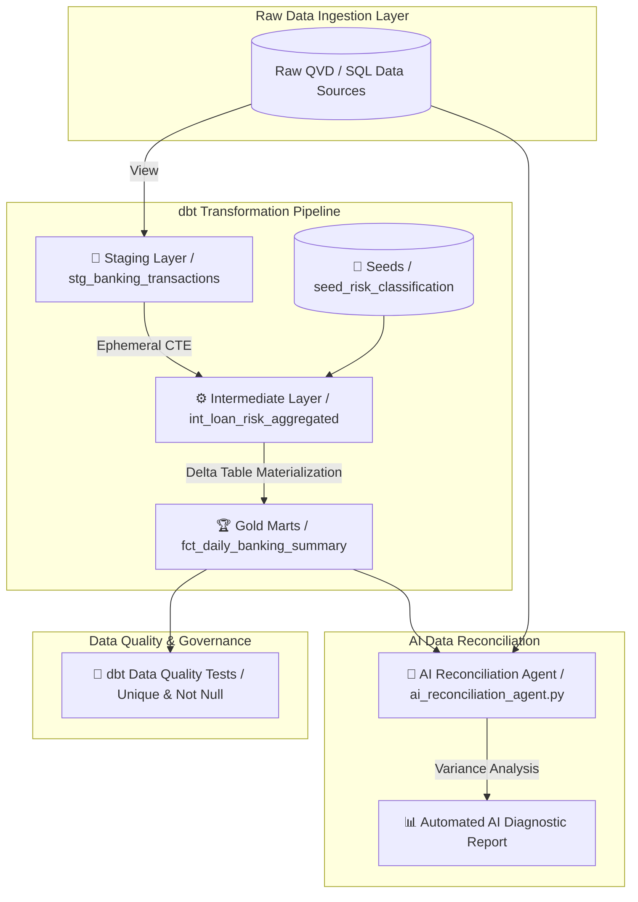

<div align="center">

# 🔄 Enterprise dbt + Databricks Data Lakehouse & AI Reconciliation Pipeline

### *Modern Analytics Engineering Framework: Qlik-to-Databricks Migration, Modular dbt Models, and AI-Driven Data Validation*

[](https://getdbt.com)
[](https://databricks.com)
[](https://openrouter.ai)
[](LICENSE)

</div>

---

## 📌 Architectural Overview

This repository demonstrates an enterprise **Analytics Engineering and Data Lakehouse Pipeline** built for migrating legacy BI architectures (Qlik Sense QVD script layers, Intellicus) into a high-performance **dbt Core + Databricks Delta Lake** infrastructure.

It includes **3-tier modular model layering (Staging → Intermediate → Gold Marts)**, automated data quality testing, static seed data mapping, and an **AI Data Reconciliation Agent** powered by OpenRouter LLMs for automated variance detection between legacy and lakehouse datasets.

---

## ⚡ Lakehouse Data Pipeline Architecture



---

## 📁 Repository Structure

```
dbt-databricks-lakehouse-pipeline/
├── README.md                      # Architecture & Execution Guide
├── dbt_project.yml                # dbt project configuration & Delta table settings
├── profiles.yml.example           # Databricks target connection profile template
├── models/
│   ├── staging/                   # Staging Layer: View materializations normalizing raw fields
│   │   ├── stg_banking_transactions.sql
│   │   ├── stg_loan_portfolio.sql
│   │   └── schema.yml
│   ├── intermediate/              # Ephemeral transformation CTEs & business logic
│   │   └── int_loan_risk_aggregated.sql
│   └── marts/                     # Gold Production Layer: Delta Table materializations
│       ├── fct_daily_banking_summary.sql
│       └── schema.yml
├── seeds/                         # Static classification & risk lookup tables
│   └── seed_risk_classification.csv
├── tests/                         # Singular custom data quality assertion tests
│   └── assert_positive_loan_amounts.sql
├── scripts/
│   ├── ai_reconciliation_agent.py  # Python AI agent for legacy vs lakehouse reconciliation
│   └── run_dbt_lakehouse.sh       # Automated pipeline runner
└── requirements.txt
```

---

## 🔑 Key Engineering Highlights

1. **Modular 3-Tier Layering**:
   - **Staging (`models/staging`)**: Standardizes date formats, null handling, and type casting from legacy QVD scripts.
   - **Intermediate (`models/intermediate`)**: Joins staging records with reference seed data inside high-performance ephemeral CTEs.
   - **Marts (`models/marts`)**: Materializes production fact tables directly into **Databricks Delta Tables** with partitioning.

2. **🤖 Automated AI Data Reconciliation**:
   - The included `scripts/ai_reconciliation_agent.py` compares row counts and monetary metrics between legacy Qlik reports and target dbt tables.
   - When variances occur, it queries OpenRouter LLMs to generate technical root-cause diagnostics and dbt SQL fix recommendations.

3. **Data Quality Governance**:
   - Enforces strict data assertions (`unique`, `not_null`, custom SQL assertions) before production deployment.

---

## 🛠️ Quickstart & Execution

```bash
# Clone Repository
git clone https://github.com/pradeepthallapelly369/dbt-databricks-lakehouse-pipeline.git
cd dbt-databricks-lakehouse-pipeline

# Install Dependencies
pip install -r requirements.txt

# Copy and configure connection profile
cp profiles.yml.example ~/.dbt/profiles.yml

# Execute complete pipeline (Seed -> Transform -> Test -> AI Reconciliation)
chmod +x scripts/run_dbt_lakehouse.sh
./scripts/run_dbt_lakehouse.sh
```

---

## 👤 Author & Maintainer

**Pradeep Thallapelly**  
*Senior AI & Data Engineer / Analytics Engineering Lead*  
- 💼 **LinkedIn**: [linkedin.com/in/pradeep-thallapelly-890b17312](https://linkedin.com/in/pradeep-thallapelly-890b17312)  
- 📧 **Email**: [pradeep.thallapelly369@outlook.com](mailto:pradeep.thallapelly369@outlook.com)  
- 🐙 **GitHub**: [@pradeepthallapelly369](https://github.com/pradeepthallapelly369)
